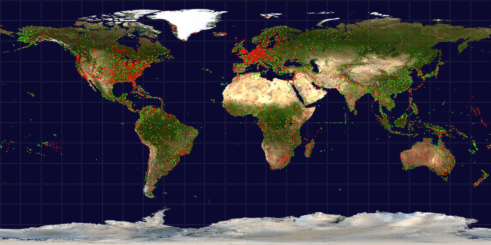

# Final Project

This dataset provides us with the absolute location (latitude and
longitude) and airlines of every airport. We can use the absolute location to
calculate the distance between two airports. (https://openflights.org/data.html) The two
datasets we will use are the airport dataset and the route dataset. The format of the dataset
will be a .dat file where each line contains detailed information for an airline route.
For detailed information, please read GOALS.pdf, DEVELOPMENT.pdf, log.txt, and RESULT.pdf.
## Name

OpenFlights data structure

## Visual


## Environment

Use clang++.

```bash
CXX = clang++
```
## Datasets

We change the empty data to "NA" for convenience.

[OpenFilghts airlines.dat](https://raw.githubusercontent.com/jpatokal/openflights/master/data/airlines.dat)

[OpenFlights routes.dat](https://raw.githubusercontent.com/jpatokal/openflights/master/data/routes.dat)


## Data Structure

Adjacent List


Vertices: 
a unique id of the airport, latitude, longitude, and some pointers.
According to their latitude and longitude, putting them in the right place in the
graph.

Edges: 
two nodes are connected by an edge if there exists an airline between them
Graph drawing: using the number of incident edges connected to each node to
decide its color. The color varies according to the degree of the node.

## Usage
The user need to input the information of the source and target. For example, we set our source to be Los Angeles International Airport and the target to be Beijing Nanyuan Airport. Then the terminal returns the sequence of the airports that is in the shortest path toward the destination. Also, the airline is indicated in the output_image_test.png.

```python
PNG png;
png.readFromFile("world_map.png");
Graph_coloring image = Graph_coloring(png);//args
vector<Vertex> vecOfV = read_airport("airport.dat");
vector<Edge> vecOfE = read_route("route.dat");
Graph g;
g.build(vecOfE, vecOfV);
Vertex source(3484, 33.94250107,-118.4079971, "LA", "LAX"); //"Los Angeles International Airport"
Vertex target(6341, 39.782798767089844,116.38800048828125, "Beijing", "NAY"); //"Beijing Nanyuan Airport"
vector<int> route = g.shortestPath(source, target);
for (size_t i = 0; i < route.size();i++) {
	std::cout << g.arrOfVertices[route[i]].IATA << std::endl;
	if (i+1 < route.size()) {
		image.drawAirline(png, g.arrOfVertices[route[i]], g.arrOfVertices[route[i+1]], 270);
	}
}
png.writeToFile("output_image_test.png");


# Output
# LAX
# YVR
# SHE
# CIF
# NAY
```

## Contributing
Pull requests are welcome. For major changes, please open an issue first to discuss what you would like to change.

Please make sure to update tests as appropriate.

## Authors and acknowledgment

Xinlong Dai

Xiuhao Ding

Zongxian Feng

Siyi Yu

(List in alphabetical order)
